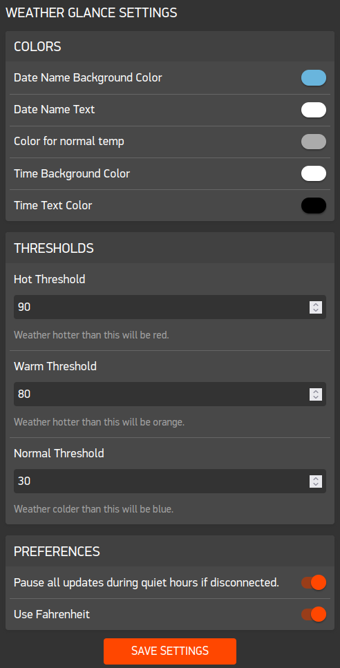

# Weather Glance

Designed to be glancable for time, or inspected for more information. Includes both date/day names and a full date for those forgetful of the day/month.

Header bar displays battery and changes color as battery goes down. A 'B' is shown when connected to bluetooth and disappears on disconnect.

Weather displays temperature and conditions for current, next 4 hours, and tomorrow high/low. An as of time shows the last fetch (generally every 5 hours). Stale data is displayed as long as it is relevant.

Features light customization with defaults heavily biasing towards my personal preferences. You can change the color of the time display and the the date names, as well as the threshold for when a weather changes color from cold -> norma -> warm -> hot.

In order to save battery, you can use a 'sleep mode' feature that pauses everything (even refreshing the screen) during quiet hours if disconnected. On end of quiet hours, it will start updating again, and on first reconnect it will refetch weather if stale.


Inspired by Loopy Time and Comic Weather.




## Notes to Self

npx live-server concept/


| Alloy font name    | Valid sizes           |
| ------------------ | --------------------- |
| `Bitham-Black`     | 30                    |
| `Bitham-Bold`      | 42                    |
| `Bitham-Light`     | 18, 34, 42            |
| `Bitham-Medium`    | 34, 42                |
| `Droid-Serif`      | 28                    |
| `Gothic-Bold`      | 14, 18, 24, 28, 36    |
| `Gothic-Regular`   | 9, 14, 18, 24, 28, 36 |
| `Leco-Bold`        | 20, 26, 32, 36, 38    |
| `Leco-Light`       | 28                    |
| `Leco-Regular`     | 42                    |
| `Roboto-Bold`      | 49                    |
| `Roboto-Condensed` | 21                    |


Tools from git@github.com:pebble-examples/cards-example.git
```sh
python3 -m venv .venv
source .venv/bin/activate
pip install -r requirements.txt
python tools/svg2pdc.py watchface/resources/cloudy.svg
```

## Commands

```
pebble emu-battery --percent 80
pebble emu-bt-connection --connected no
pebble emu-set-timeline-quick-view on
pebble emu-time-format --emulator emery --format 12h
BROWSER=firefox pebble emu-app-config
```
